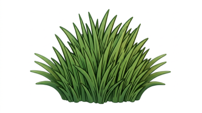
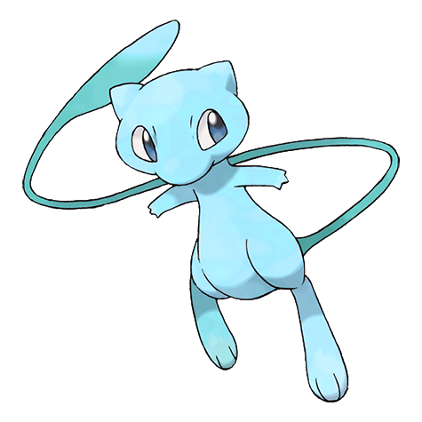
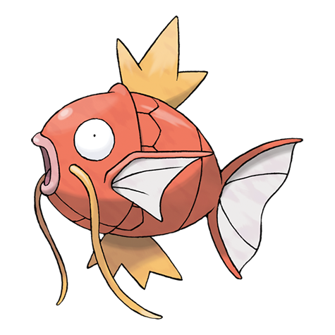
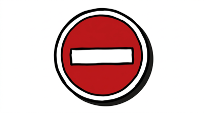

# PRD: Pokémon Tall Grass — Art of the Web S2A2

## Overview
A single-page, self-contained HTML/CSS site (no JavaScript) themed around the Pokémon tall grass encounter mechanic. Three animated grass patches sit side by side. Hovering rustles the grass; clicking commits a reveal. One patch hides a Shiny Mew, one hides a Magikarp, one shows a No Entry sign. A reset mechanic (pure CSS) lets users play again. Built for GitHub Pages, under 1mb total.

---

## File Structure
```
index.html        ← single file, all CSS embedded in <style>
/img/
  grass.png       ← tall grass illustration or SVG-based PNG
  mew-shiny.png   ← Shiny Mew official artwork (from PokeAPI)
  magikarp.png    ← Magikarp official artwork (from PokeAPI)
  no-entry.png    ← No Entry / blocked sign illustration
  bg.png          ← route background / sky scene
README.md
```
All images must be optimized and collectively under 1mb.  
PokeAPI artwork source: `https://pokeapi.co/api/v2/pokemon/{id}` → official-artwork sprites.

---

## Visual Style
- **Aesthetic:** Neo-brutalist — bold black borders (3–4px solid), flat block colors, slight drop shadows (offset, no blur), chunky layout
- **Generation:** Modern Pokémon games (Scarlet/Violet era) — not 8-bit, not pixel art
- **Palette:** Route green (`#5a9e3a`), sky blue (`#87ceeb`), Pokémon yellow (`#ffcb05`), dark navy (`#1a1a2e`), white, black
- **Typography:** `'Nunito'` or `'Poppins'` from Google Fonts — bold weights, clean, fun
- **Layout:** Fullscreen single page. Background is a stylized Pokémon route (sky + ground). Three grass patches centered horizontally, side by side.

---

## HTML Structure

```html
<!DOCTYPE html>
<html lang="en">
<head>
  <meta charset="UTF-8">
  <meta name="viewport" content="width=device-width, initial-scale=1.0">
  <meta name="description" content="A Pokémon tall grass encounter — which patch will you choose?">
  <title>Tall Grass Encounter</title>
  <link rel="stylesheet" href="..."> <!-- or embedded <style> -->
</head>
<body>

  <!-- Page header -->
  <header id="page-header">
    <h1>A rustling in the tall grass...</h1>
    <p>Hover to investigate. Click to commit.</p>
  </header>

  <!-- Reset link (CSS :target hack) -->
  <a href="#" id="reset-btn">↩ Try Again</a>

  <!-- Three grass patches using checkbox hack -->
  <main id="field">

    <!-- Patch 1: Shiny Mew -->
    <div class="patch-wrapper" id="patch-mew">
      <input type="radio" name="grass" id="choose-mew">
      <label for="choose-mew" class="grass-patch" title="A rustling patch of tall grass">
        
        <span class="grass-question">?</span>
      </label>
      <div class="reveal mew-reveal">
        
        <div class="encounter-text">
          <h2>A wild <span class="shiny-label">✨ Shiny Mew</span> appeared!</h2>
          <p>"This is a miracle. Trainers search their whole lives for this moment."</p>
        </div>
      </div>
    </div>

    <!-- Patch 2: Magikarp -->
    <div class="patch-wrapper" id="patch-magikarp">
      <input type="radio" name="grass" id="choose-magikarp">
      <label for="choose-magikarp" class="grass-patch" title="A rustling patch of tall grass">
        
        <span class="grass-question">?</span>
      </label>
      <div class="reveal magikarp-reveal">
        
        <div class="encounter-text">
          <h2>A wild <span class="common-label">Magikarp</span> appeared.</h2>
          <p>"It splashed around uselessly. As always."</p>
        </div>
      </div>
    </div>

    <!-- Patch 3: No Entry -->
    <div class="patch-wrapper" id="patch-blocked">
      <input type="radio" name="grass" id="choose-blocked">
      <label for="choose-blocked" class="grass-patch locked" title="This patch of grass seems strangely still">
        
        <span class="grass-question">!</span>
      </label>
      <div class="reveal blocked-reveal">
        
        <div class="encounter-text">
          <h2>The grass won't budge.</h2>
          <p>"Something is blocking the way. This path is closed."</p>
        </div>
      </div>
    </div>

  </main>

  <!-- Page footer -->
  <footer id="page-footer">
    <p>Pokémon and all related names are trademarks of Nintendo / Game Freak.</p>
  </footer>

</body>
</html>
```

---

## CSS Requirements

### 1. CSS Selectors (from code snippet pattern — must use all three)

```css
/* ~ General sibling: when a radio is :checked, show its sibling reveal panel */
#choose-mew:checked ~ .mew-reveal { display: flex; }
#choose-magikarp:checked ~ .magikarp-reveal { display: flex; }
#choose-blocked:checked ~ .blocked-reveal { display: flex; }

/* > Child selector: hover on grass-patch scales the child grass-img */
.grass-patch:hover > .grass-img { transform: scale(1.05) rotate(-2deg); }

/* + Adjacent sibling: :checked radio hides the adjacent label (grass patch) */
#choose-mew:checked + .grass-patch { opacity: 0.4; pointer-events: none; }

/* :hover on patch-wrapper affects sibling patch-wrappers (dim others) */
.patch-wrapper:hover ~ .patch-wrapper { opacity: 0.6; }

/* :focus on label for keyboard accessibility */
.grass-patch:focus { outline: 4px solid #ffcb05; }

/* :active press feedback */
.grass-patch:active { transform: scale(0.97); }
```

### 2. Viewport Units — all sizing uses vw/vh/vmin (no px for layout)

```css
body { font-size: 2vmin; }
h1 { font-size: 4vw; }
#field { 
  display: flex; 
  gap: 3vw; 
  padding: 5vh 5vw; 
}
.grass-patch { 
  width: 25vw; 
  height: 40vh; 
}
.pokemon-img { 
  width: 20vmin; 
  height: auto; 
}
```

### 3. Media Queries — minimum 3

```css
/* Base: desktop (>= 1024px) — horizontal row */

@media (max-width: 1023px) {
  /* Tablet: slightly smaller patches, adjusted font */
  #field { gap: 2vw; }
  .grass-patch { width: 28vw; height: 35vh; }
  h1 { font-size: 5vw; }
}

@media (max-width: 767px) {
  /* Mobile: stack patches vertically */
  #field { flex-direction: column; align-items: center; }
  .grass-patch { width: 70vw; height: 25vh; }
  h1 { font-size: 6vw; }
}

@media (max-width: 480px) {
  /* Small mobile: full width, tighter layout */
  .grass-patch { width: 90vw; height: 20vh; }
  h1 { font-size: 7vw; }
  .encounter-text p { font-size: 3vw; }
}
```

### 4. Grass Rustling Animation (CSS keyframes)

```css
@keyframes rustle {
  0%   { transform: rotate(0deg); }
  25%  { transform: rotate(-3deg) translateX(-2px); }
  50%  { transform: rotate(3deg) translateX(2px); }
  75%  { transform: rotate(-2deg); }
  100% { transform: rotate(0deg); }
}

.grass-patch:hover > .grass-img {
  animation: rustle 0.4s ease-in-out infinite;
}
```

### 5. Checkbox Hack / Reveal Logic

```css
/* Hide radio inputs visually */
input[type="radio"] { display: none; }

/* Hide reveals by default */
.reveal { display: none; }

/* Show reveal when corresponding radio is checked */
#choose-mew:checked ~ .mew-reveal     { display: flex; }
#choose-magikarp:checked ~ .magikarp-reveal { display: flex; }
#choose-blocked:checked ~ .blocked-reveal  { display: flex; }

/* Show reset button once any radio is checked */
input[type="radio"]:checked ~ * #reset-btn { display: block; }
/* Note: reset button uses <a href="#"> to deselect :target state */
```

### 6. Neo-Brutalist Styles

```css
.grass-patch {
  border: 3px solid #1a1a2e;
  box-shadow: 6px 6px 0px #1a1a2e;
  background-color: #5a9e3a;
  cursor: pointer;
  transition: transform 0.15s ease, box-shadow 0.15s ease;
  position: relative;
  overflow: hidden;
}

.grass-patch:hover {
  box-shadow: 8px 8px 0px #1a1a2e;
  transform: translate(-2px, -2px);
}

.reveal {
  border: 3px solid #1a1a2e;
  box-shadow: 6px 6px 0px #1a1a2e;
  background: white;
  padding: 2vw;
  flex-direction: column;
  align-items: center;
  gap: 1.5vh;
}

.shiny-label { color: #4fc3f7; font-weight: 900; }
.common-label { color: #ef5350; font-weight: 700; }
```

---

## Images Checklist (5 minimum, all with alt text)

| File | Alt Text | Notes |
|------|----------|-------|
| `grass.png` | "Tall grass rustling in the breeze" | Used 3x, same file |
| `mew-shiny.png` | "A rare Shiny Mew, glowing blue, floats gently in the air" | PokeAPI official artwork |
| `magikarp.png` | "A Magikarp flops around on the ground, looking confused" | PokeAPI official artwork |
| `no-entry.png` | "A red and white No Entry sign blocks the path forward" | Illustrated or icon |
| `bg.png` | "A sunny Pokémon route with green hills and blue sky" | Background scene |

All images should be compressed (use [Squoosh](https://squoosh.app) or [TinyPNG](https://tinypng.com)).  
Target: each image < 150kb. Total page < 1mb.

---

## Reset Mechanic (Pure CSS, No JS)

Use radio button group — selecting any patch locks in a choice.  
Reset button is `<a href="#">Try Again</a>` which clears the URL hash.  

Alternative approach: wrap in a `<form>` with a reset `<button type="reset">` — this natively clears all radio inputs without JavaScript.

```html
<form id="game-form">
  <!-- all inputs and labels inside here -->
  <button type="reset" id="reset-btn">↩ Try Again</button>
</form>
```
```css
#reset-btn { display: none; }
input[type="radio"]:checked ~ ... #reset-btn { display: block; } 
/* OR just always show reset-btn — simpler and still valid */
```

---

## Assignment Requirements Checklist

| Requirement | Implementation |
|-------------|----------------|
| Single-page site | `index.html` — all CSS embedded |
| Under 1mb total | Optimized images, no external JS |
| 5+ images with alt text | ✅ grass (×3 reuse), mew-shiny, magikarp, no-entry, bg |
| CSS selector `:hover` | Grass rustle animation |
| CSS selector `:active` | Patch press scale-down |
| CSS selector `:focus` | Yellow outline on label |
| CSS selector `:checked` | Reveal panel toggle |
| CSS `~` general sibling | Checked radio → reveal panel |
| CSS `+` adjacent sibling | Checked radio → hide/dim label |
| CSS `>` child selector | Hover patch → animate child img |
| Viewport units (vw/vh/vmin) | All layout, type, spacing |
| 3+ @media rules | 1024px, 767px, 480px breakpoints |
| No JavaScript | Pure CSS checkbox/form reset hack |
| GitHub Pages ready | Relative paths, no server dependencies |

---

## Pokémon Content

| Patch | Pokémon | Rarity Text | Flavour |
|-------|---------|-------------|---------|
| 1 | ✨ Shiny Mew | Ultra Rare | "This is a miracle. Trainers search their whole lives for this moment." |
| 2 | Magikarp | Common | "It splashed around uselessly. As always." |
| 3 | No Entry | Blocked | "The grass won't budge. Something is blocking the way." |

---

## Image Sources
- **Mew Shiny:** `https://raw.githubusercontent.com/PokeAPI/sprites/master/sprites/pokemon/other/official-artwork/shiny/151.png`
- **Magikarp:** `https://raw.githubusercontent.com/PokeAPI/sprites/master/sprites/pokemon/other/official-artwork/129.png`
- Download these and optimize locally before uploading to GitHub.
